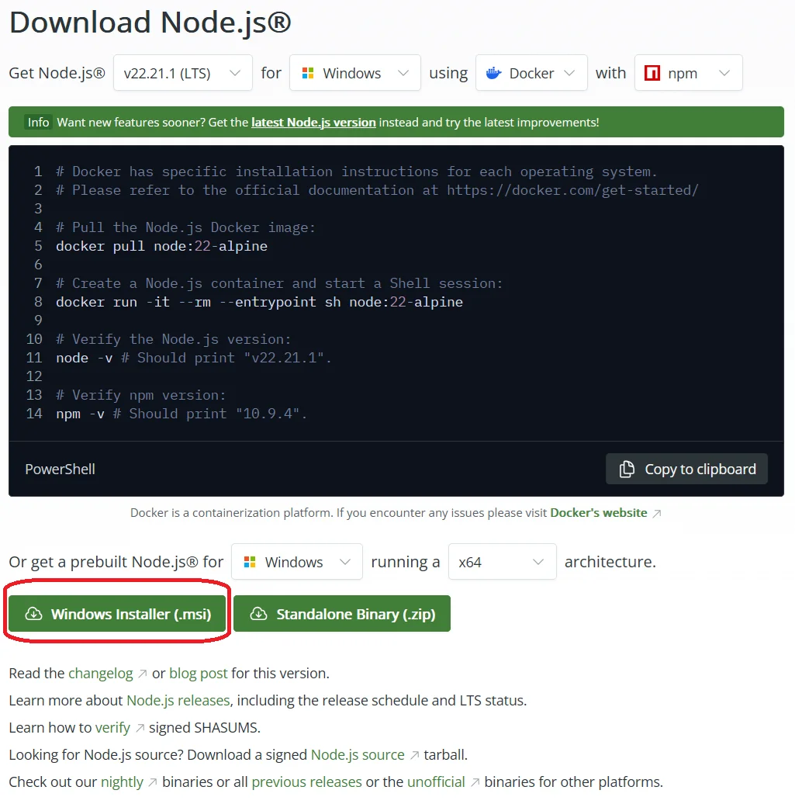

[](https://github.com/fluentis-doc/FluentisErp/actions/workflows/test-deploy.yml)
[](https://github.com/fluentis-doc/FluentisErp/actions/workflows/deploy.yml)

# Fluentis Documentation – Docusaurus 3

This repository contains the Fluentis documentation website built with **Docusaurus 3**.

To ensure that local builds behave exactly the same as GitHub Actions, the project uses **Node.js 22 LTS** everywhere.

---

## 🚀 Requirements

### ✅ Node.js 22 LTS (mandatory)

Docusaurus 3.7.0 and its plugins are tested with Node **18 / 20 / 22**.  
We standardized on **Node 22** because it is the newest stable LTS that works reliably in both local and CI builds.

---

## 🖥 Installing Node 22 (Windows)

Download and install Node.js 22 LTS using the official Windows installer:



1. Go to: <https://nodejs.org/en/download/prebuilt-installer>  
2. Select **Windows Installer (.msi)**  
3. Install using the default settings  
4. Verify installation:

```powershell
node -v
# should print: v22.x.x
```

---

## 🖥 Installing Node 22 (WSL / macOS)

If you're using **WSL** or **macOS**, install Node 22 via NVM:

```bash
nvm install 22 --lts
nvm use 22
```

This project includes an `.nvmrc` file, so inside the repository you can also run:

```bash
nvm use
```

to automatically switch to Node 22.

---

## 📦 Install Dependencies

```bash
npm install
```

---

## ▶️ Local Development

```bash
npm run start
```

This starts a development server at `http://localhost:3000/` with hot reload.

---

## 🏗️ Build the Documentation

```bash
npm run build
```

This generates static website files in the `build/` directory.

---

## 🚢 Deployment

Deployment to GitHub Pages is handled automatically by GitHub Actions via:

```
.github/workflows/deploy.yml
```

You do **not** need to manually deploy anything.

---

## 👥 Notes for Team Members

- Always make sure you are using **Node 22** before installing dependencies or building.
- If you switch Node versions, run:

```bash
rm -rf node_modules package-lock.json
npm install
```

- Keeping Node 22 consistent ensures that local builds match CI behavior exactly.
