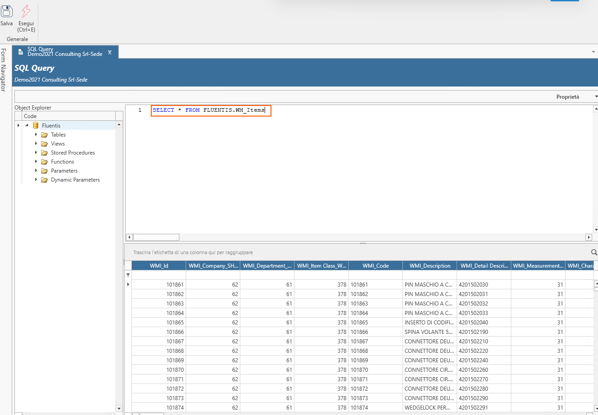
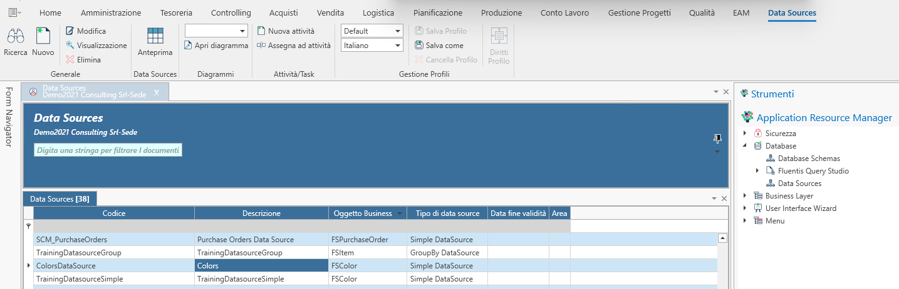

# Datasources / SQL Query / Fluentis Query Studio

## Overview
In questa pagina vediamo una panoramica generale degli strumenti messi a disposizione da Fluentis per interagire con la base dati.  
Il nodo **database** consente all'utente di Fluentis di eseguire determinate operazioni sulla base dati di Fluentis.   
Il nodo, si compone delle seguenti voci:
* Database Schemas
* Fluentis Query Studio
  * Nuova query SQL
  * Esempi
  * Esportazione in Excel
  * Esportazione in una grid
* Data Sources

### Database Schemas
la voce **database schemas** apre una form read-write che consente di aggiungere degli schemi del database oltre a quelli già presenti a standard.  

La form è composta da:
* un ribbon menu con le consuete azioni (search, create, delete).
* un filtro standard che permette di filtrare i record per Nome e/o per Natura.
* Una griglia dei risultati che permette di visualizzare a schermo i database schema presenti.

Per la creazione di nuove tabelle a database, anche mediante dei wizard automatizzati (vedi wizard per l'extension), è **necessario** creare un database schema custom.

### Fluentis Query Studio
Lo strumento Fluentis Query Studio permette un'interazione con la base dati Fluentis previa associazione di appositi diritti all'utente da Arm.  

La form, come mostrato in figura, si compone di:
* un ribbon, (Salva, Esegui).
* sulla destra un object explorer che permette di espandere i diversi elementi della base dati (Tabelle, Viste, Stored Procedure, Funzioni, Parametri, Parametri dinamici).
* sulla sinistra in alto un editor che permette la scrittura di query SQL.
* sul sinistra in basso la griglia dei risultati della query.  

### Data Sources

I datasource sono delle sorgenti dati che permettono l'esposizione di dati in modo strutturato ed organizzato, e possono essere riutilizzato per popolare dashboard e/o extradata.  
La form dei datasource si compone così come segue:  
* un Ribbon menu: con le consuete azioni permesse all'utente circa la creazione, modifica, eliminazione di nuovi record.  
* un filtro standard che permette la ricerca dei record.  
* una griglia dei risultati che permette la visualizzazione dei records (datasources).

