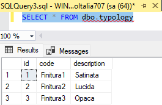
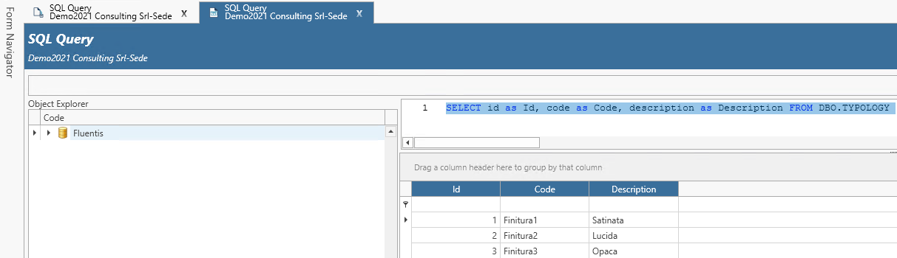
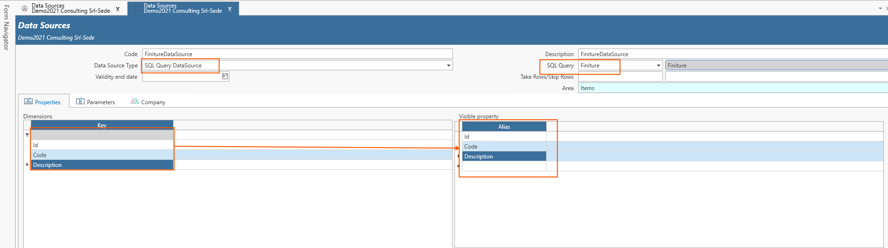
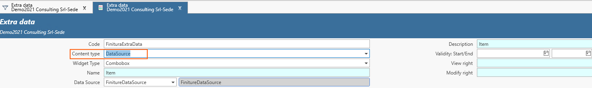
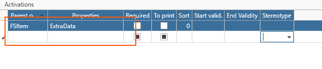
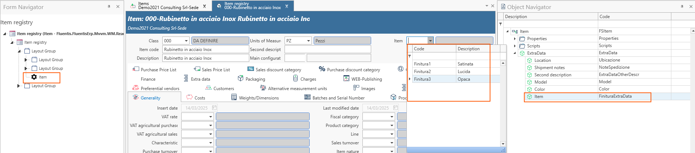

# ExtraData Basato su Datasource - Aspetti introduttivi

Tramite l'ExtraData basato su un datasource è possibile legare un oggetto Fluentis ad una tabella esterna non presente a standard.  
*Per spiegare meglio questo scenario applicativo utilizziamo un esempio pratico dove è stata creata una tabella custom denominata 'typology', che rappresenta n. 3 diverse finiture*


Tramite il FluentisQueryStudio, procediamo a salvare una query SQL per la selezione di tutti i valori nella tabella.  

```SQL
SELECT id as Id, code as Code, description as Description FROM DBO.TYPOLOGY

```
:::danger
La struttura della query deve essere necessariamente basata sulle tre colonne: **Id**, **Code**, **Description**, altrimenti non sarà possibile creare il relativo datasource.  
:::



Tramite il FluentisQueryStudio procediamo a creare il datasource che sarà basato sulla query vista sopra.  



Salviamo il datasource.  

## Testata
Procediamo ora a creare l'ExtraData popolando i dati relativi alla testata. 



* Code e descrizione.
* DatsSource Type: selezionare SQL Query DataSource.
* SQL Query: selezionare la query desiderata.
* Area: valore di dizionario.

## Attivazioni
Procediamo a legare l'**ExtraData** all'oggetto di business **FSItem** (Articolo).  



Vale esattamente quanto illustrato nell'introduzione agli ExtraData.  

## Inserimento dell'ExtraData nella form di dettaglio

Dopo aver aperto la form di dettaglio dell'articolo interessato, per includere l'ExtraData nella form di dettaglio dell'articolo (FSItem), possiamo utilizzare il **form navigator** e **l'object navigator**.  
1. Dall'**Object Navigator**, espandiamo il nodo ExtraData relativo all'oggetto di business e selezionamo l'ExtraData che ci interessa.
2. Dal **Form Navigator**, espandiamo il navigator fino al tab Generalità di cui vogliamo inserire l'ExtraData.  



Per visualizzare l'ExtraData nella form di dettaglio dell'articolo è sufficiente fare drag and drop dal Navigatore Oggetti al Form Navigator.  
Nell'esempio è stato riportato L'ExtraData 'Item' nel LayoutGroup che definisce i dati di testata dell'articolo (FSItem).   
L'ExtraData avrà un widget di tipo combobox (dropdown) e mostrerà esattamente i valori di **codice** e **descrizione** salvati sulla corrispondente tabella lato MSSQL.  

